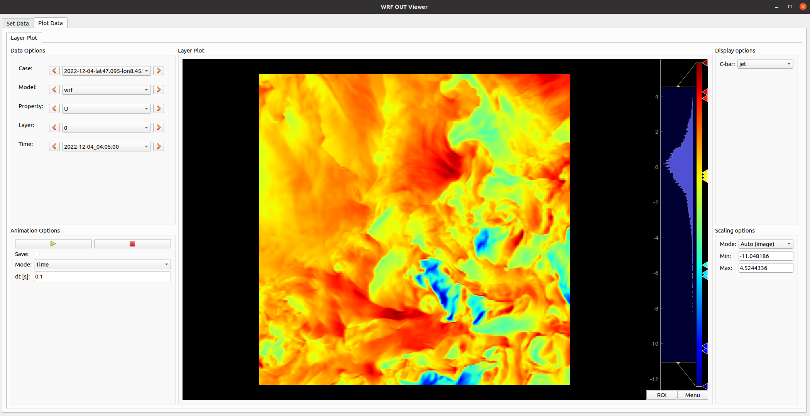

# WRF-Viewer
<div>
<a href="https://github.com/ethz-asl/wrf-viewer/blob/main/LICENSE"></a>
</div>

This repo contains the code to visualize the output of a WRF-ARW run, e.g. computed using [wrf-sim](https://github.com/ethz-asl/wrf-sim).

## Installation
Install the necessary python packages:
```
pip install -r requirements.txt
```

## Execution
Navigate to the source folder and execute the main script:
```
python main.py
```

This will then open the GUI in the loading screen. To display the output of an WRF run click on  `Select wrfout folder` and select the folder containing all the `wrfout_*.nc` files. To visualize the postprocessed output using the [wrf-sim](https://github.com/ethz-asl/wrf-sim) package click on the `Select nc dataset file` and select the corresponding file.

<p align="center">
  
</p>

This will then load the data and the GUI will switch to the plot screen and enable you to visualize the data. 

<p align="center">
  
</p>

With the `Data Options` you can select the data being plotted such as changing the property, the layer, or the timestamp shown.

The `Animation Options` allow to toggle an animation of the data by sweeping either through different timestamps for a fixed layer and property with the `Time` mode selected or for a fixed timestamp and property through all layers with the `Layer` mode selected. By ticking the `save` box a snapshot of every frame will get saved.

The colorbar can the scaling of the data can be changed with the options on the right side of the GUI. The following scaling modes are currently supported:
- Auto (Image): Adjusts the scaling to the min/max of the current displayed image.
- Auto (Timestamp): Computes the min/max for the current property through all layers for the currently selected timestamp. 
- Auto (Layer): Computes the min/max for the current property through all timestamps for the currently selected layer.
-  Auto (All Data): Computes the min/max through all layers and timestamps for the currently selected property.
- Custom: Allows to set custom min/max through the respective fields.
